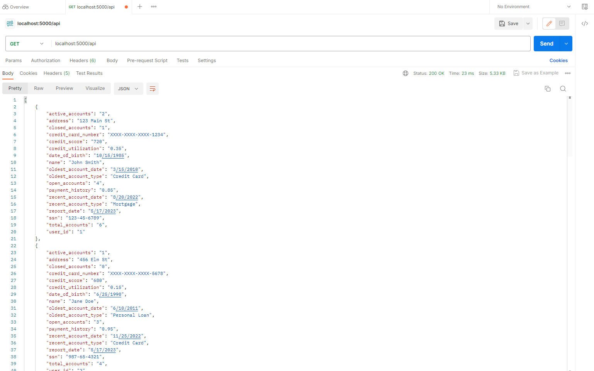

# creditbureauproject
How to run this project?
> Step 1: python customcredit.py # this file will create datasets using which API will be createed

> Step2: python main.py # runs the flask project that will server api and also all the functionality of the project integrateed

> Step3: open localhost:5000/api in the POSTMAN or Browser to check the response from the API

